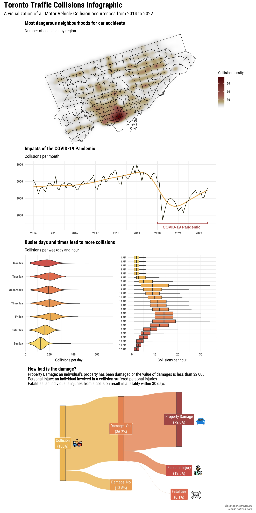

# Toronto Traffic Collisions Infographic

Data Visualization for the Toronto Traffic Collisions dataset, available at Toronto's Open Data Portal.

This infographic was made as the Final Project for the Data Visualization (STAT842) course at the University of Waterloo.

